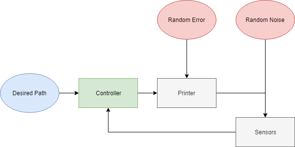
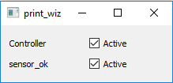

# printwiz5000

print_wiz is a python 3.7 compatible package that impliments a simple simulation example of a 3D printer controller with sensors. A GUI
controls the state of the controller and sensors. An example of 1 sensor with various levels of
noramally distributed random noise and a simple averging estimator is given. Various locations are
broadcast to a Promethues server on the localhost port 8000. A sample wall path is given. The example can be run from [print_wiz/gui.py](print_wiz/gui.py).

The sensors give xyz location with random normally distributed noise on each dimension. The printer randomly misses the target in the y axis.

The gui alows a user to activate or deactivate the controller or sensors individually. The gui consists of labels of the the controller and sensors on the left and checkboxes that activate or deactivate the controller/senor on the right. By unchecking the controller box, no move command will be sent to the printer and the controller will not poll the sensors. When a sensor box is unchecked, it will continue to report it's last known location even if the printer continues to move.

Possible enhancements:
-----------------------
* Add physics to the printer motion. Currently the printer moves instantly when commanded.
* Impliment more advanced control law (e.g. PID, lqg)
* Use more realistic sensor data (encoder reading, laser distance, etc.) and estimation (Khalman filter)
* More statuses and data broadcasting
* UI beautification

diagram made with https://www.draw.io/
