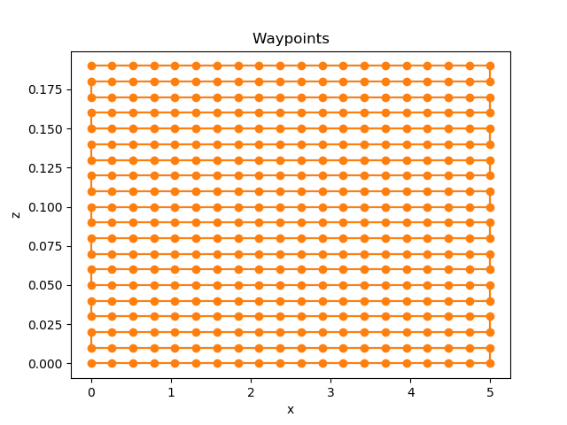

# printwiz5000

print_wiz is a python 3.7 compatible package that impliments a simple simulation example of a 3D printer controller with sensors. A GUI
controls the state of the controller and sensors. An example of 3 sensors with various levels of
noramally distributed random noise and a simple averging estimator is given. Various locations are
broadcast to a Promethues server on the localhost port 8000. A sample wall path is given. The example can be run from [print_wiz/gui.py](print_wiz/gui.py).

Possible enhancements:
-----------------------
* Add physics to the printer motion. Currently the printer moves instantly when commanded.
* Impliment more advanced control law (e.g. PID, lqg)
* Use more realistic sensor data (encoder reading, laser distance, etc.) and estimation (Khalman filter)
* More statuses and data broadcasting
* Separate sensor and controller processes and use inter-process communication
* UI beautification
